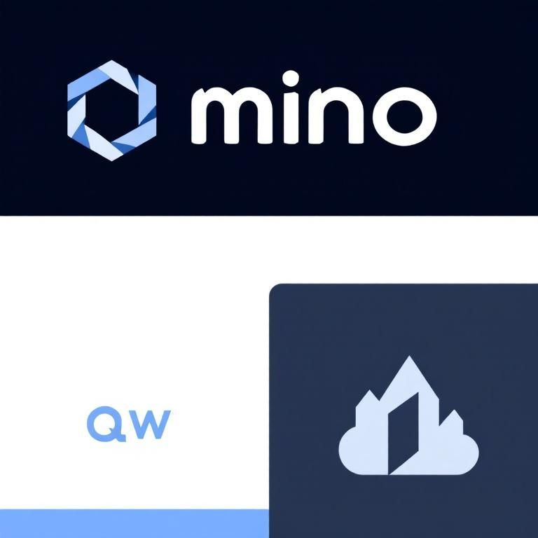
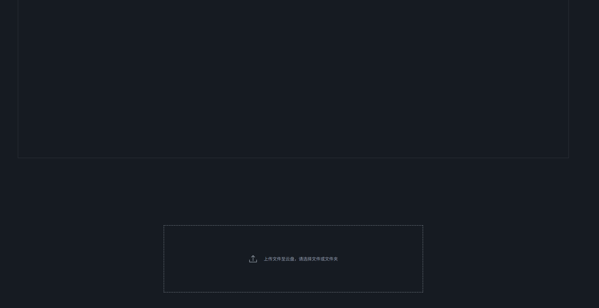
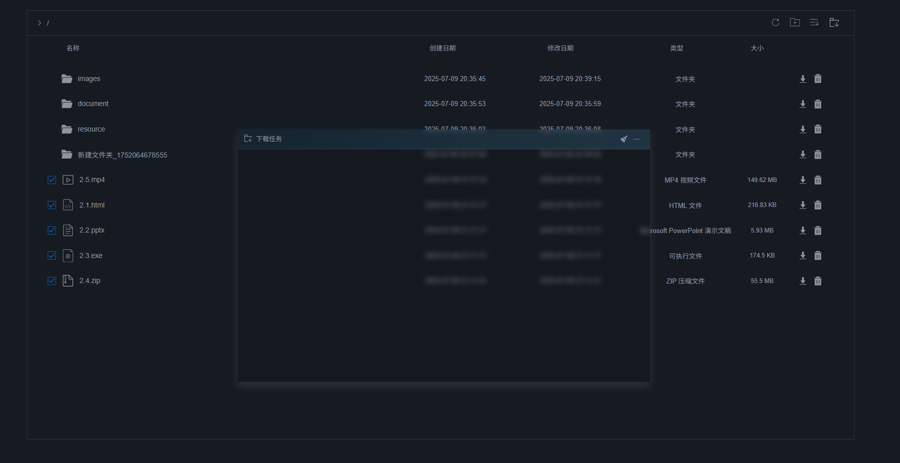
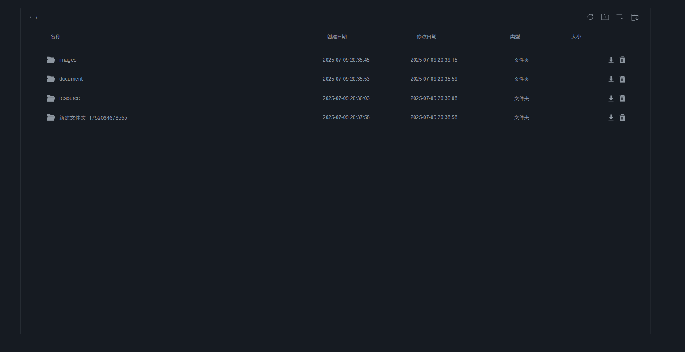
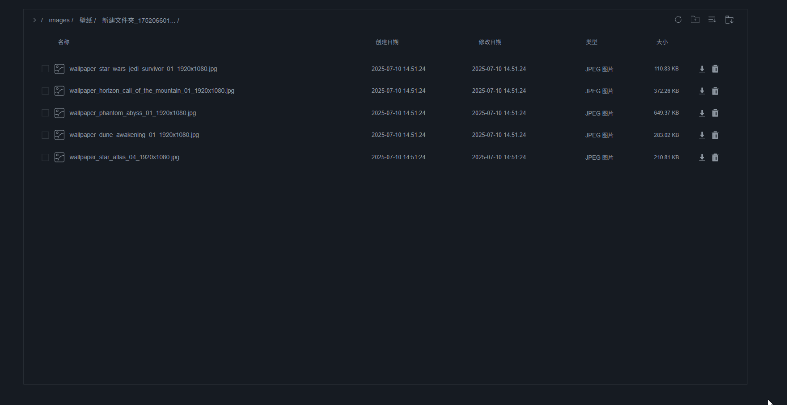
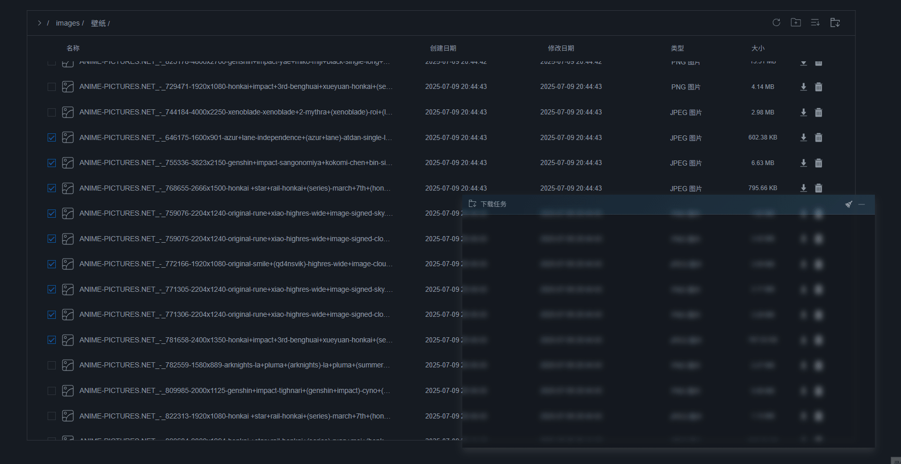
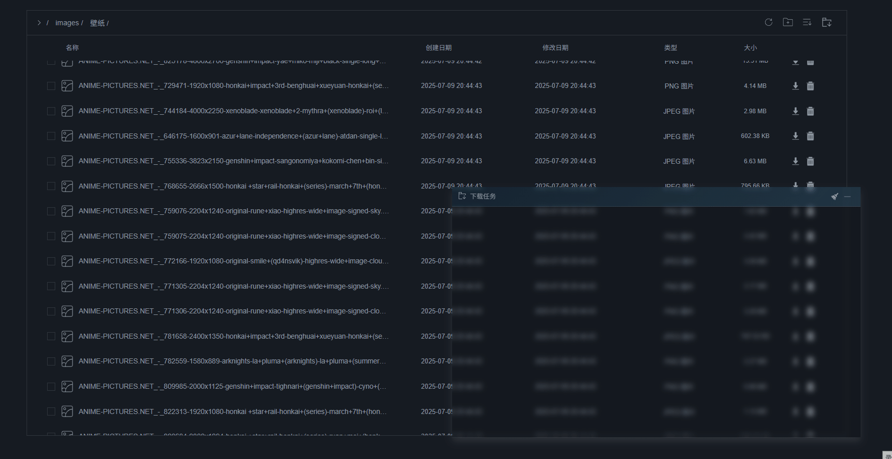

<a id="readme-top"></a>

### [English](https://github.com/g-qw/mcs/blob/main/README.en.md) | [简体中文](https://github.com/g-qw/mcs/blob/main/README.md)

<!-- PROJECT SHIELDS -->
<!--
*** I'm using markdown "reference style" links for readability.
*** Reference links are enclosed in brackets [ ] instead of parentheses ( ).
*** See the bottom of this document for the declaration of the reference variables
*** for contributors-url, forks-url, etc. This is an optional, concise syntax you may use.
*** https://www.markdownguide.org/basic-syntax/#reference-style-links
-->
[![Contributors][contributors-shield]][contributors-url]
[![Forks][forks-shield]][forks-url]
[![Stargazers][stars-shield]][stars-url]
[![Issues][issues-shield]][issues-url]
[![Unlicense License][license-shield]][license-url]
[![LinkedIn][linkedin-shield]][linkedin-url]

<!-- PROJECT LOGO -->
<br />
<div align="center">
<a href="https://github.com/g-qw/mcs">

</a>

<h3 align="center">Minio Cloud Storage</h3>

<p align="center">
A web cloud storage system built on MinIO is designed to provide a responsive, high-performance and highly concurrent storage and browsing experience.
<br />
<a href="https://github.com/g-qw/mcs"><strong>Explore Documents »</strong></a>
<br />
<br />
<a href="https://github.com/g-qw/mcs">View the demo</a>
&middot;
<a href="https://github.com/g-qw/mcs/issues/new/choose">Report a problem</a>
&middot;
<a href="https://github.com/g-qw/mcs/issues/new/choose">Request function</a>
</p>
</div>

- [About the project](#about-the-project)
  - [Supported features](#supported-features)
  - [Project Objectives](#project-objectives)
  - [Technology stack](#technology-stack)
- [Get started](#get-started)
  - [Prerequisites](#prerequisites)
  - [Installation steps](#installation-steps)
- [How to use](#how-to-use)
- [Performance Test](#performance-test)
  - [JMeter Stress Test](#jmeter-stress-test)
- [Roadmap](#roadmap)
- [Contribution Guide](#contribution-guide)
  - [Key Contributors](#key-contributors)
- [License Agreement](#license-agreement)
- [Contact information](#contact-information)
- [Acknowledgements](#acknowledgements)

<!-- ABOUT THE PROJECT -->
## About the project

MinIO is an open source high-performance distributed object storage system. This project builds a microservice cloud storage system based on MinIO. The entire system is built using the Spring Boot technology stack and uses the popular microservice architecture, covering user services, mailbox services, upload services, download services, file system services and gateway services, for identity verification and load balancing. On the front end, a GitHub-style web UI is built using Vue 3, aiming to provide users with a convenient experience similar to Windows File Explorer. The entire UI is simple and linear, smooth and natural, and it is really cool to use!

### Supported features

- Responsive, support for concurrent file upload and download
- Supports single file upload, multi-file upload, and chunk upload
- Support single file download and chunk download
- Automatically select the appropriate method to upload when uploading and downloading files
- Virtual file system, supports file management, folder creation and name modification

### Project Objectives

The browser is powerful, but it has not been fully utilized to address file preview and entertainment needs. If you add preview functions to cloud disk files based on your browser, cloud storage services can be upgraded from simple storage tools to a comprehensive ecosystem. Users can preview various files in the browser without switching software, saving time and energy and avoiding compatibility issues.

Moreover, cloud storage systems can enhance services by integrating powerful programs. For example, use FFmpeg to process pictures, videos, music, documents and other files, and realize functions such as transcoding, cropping, and editing. At the same time, it integrates applications such as open source document editor, picture viewer and code editor, allowing users to preview, edit and process files in the browser. In addition, combining crawling technology, automated data collection and organization can be realized, helping users to capture valuable information from the Internet and store it in the cloud disk, further enriching the content and application scenarios of cloud storage, and creating a powerful and comprehensive cloud storage ecosystem to meet the diverse needs of users.

It is indeed not easy to achieve these goals, and there are challenges in technology, resources, time and other aspects. But I look forward to it being realized one day, and I hope that interested friends can join us to develop!

 [product-screenshot](https://github.com/g-qw/mcs)

<p align="right"><a href="#readme-top">↑</a></p>

### Technology stack

This is the technology stack currently used:

- [![Spring Boot][SpringBoot]][SpringBoot-url]
- [![Spring WebFlux][SpringWebFlux]][SpringWebFlux-url]
- [![Spring Gateway][SpringGateway]][SpringGateway-url]
- [![MyBatis][MyBatis]][MyBatis-url]
- [![Redis][Redis]][Redis-url]
- [![Vue 3][Vue3]][Vue3-url]

<!-- URLs -->
[SpringBoot]: https://img.shields.io/badge/SpringBoot-6DB33F?style=for-the-badge&logo=springboot&logoColor=white
[SpringBoot-url]: https://spring.io/projects/spring-boot
[SpringWebFlux]: https://img.shields.io/badge/Spring%20WebFlux-6DB33F?style=for-the-badge&logo=spring&logoColor=white
[SpringWebFlux-url]: https://spring.io/projects/spring-webflux
[SpringGateway]: https://img.shields.io/badge/Spring%20Gateway-6DB33F?style=for-the-badge&logo=spring&logoColor=white
[SpringGateway-url]: https://spring.io/projects/spring-cloud-gateway
[MyBatis]: https://img.shields.io/badge/MyBatis-007991?style=for-the-badge&logo=mybatis&logoColor=white
[MyBatis-url]: https://mybatis.org/
[Redis]: https://img.shields.io/badge/Redis-DC382D?style=for-the-badge&logo=redis&logoColor=white
[Redis-url]: https://redis.io/
[Vue3]: https://img.shields.io/badge/Vue.js-4FC08D?style=for-the-badge&logo=vue.js&logoColor=white
[Vue3-url]: https://vuejs.org/

<p align="right"><a href="#readme-top">↑</a></p>

<!-- GETTING STARTED -->
## Get started

Here is an example description of how to set up a project locally. Follow these simple example steps to run the replica locally.

### Prerequisites

I will list the basic service components and dependencies required to build this project below. Note that this project is developed on Windows:

- [nacos-server-2.5.0](https://nacos.io/download/release-history/?spm=5238cd80.6a33be36.0.0.10651e5dOU7bmS)

- [postgresql-15.13-2](https://www.postgresql.org/download/)
- [postgresql zip archive](https://www.enterprisedb.com/download-postgresql-binaries)

- [Redis 8.0.3 for Windows](https://github.com/redis-windows/redis-windows/releases/tag/8.0.3)

- [MinIO Server & MinIO Client](https://www.minio.org.cn/download.shtml#/windows)

- [Node.js v20.3.1](https://nodejs.org/zh-cn/download)

### Installation steps

The following are the detailed steps for installing and deploying this project on a Windows system:

(1) Clone the project locally

```bash
git clone <git@github.com>:g-qw/mcs.git
```

(2) Install and initialize postgresql. I use the postgresql Windows version that is zip, and perform the following in the decompressed directory of pgsql (note that it is replaced with your installation directory):

```bash
cd path/to/pgsql
mkdir data
initdb -D "./data" -U postgres -A password -W
```

Start pgsql:

```bash
cd ./bin && pg_ctl -D ../data -l ../logs/logfile.txt start
```

Stop pgsql:

```bash
cd ./bin && pg_ctl -D ../data stop
```

Execute the project `init/db_init.sql` initialize the database

(3) Initial minio, in your minio installation directory (including `mc`,`minio` path) perform the following operations

Create your password file `.pwd`, you can edit this file before starting to modify the administrator password:

```bash
echo "minio_password" > .pwd
```

This bat script can be started each time `minio`, started `minio` contains a username `minio_admin`, the password is `.pwd` superusers of content:

```bash
@echo off
set MINIO_ROOT_USER=minio_admin
set /p MINIO_ROOT_PASSWORD=<.pwd
minio.exe server ./data --address 127.0.0.1:9000 --console-address 127.0.0.1:9090
pause
```

(4) For yours `Redis` add a password, in `redis.conf` add configuration:

```bash
requirepass "your_password" 
```

double click `redis` installation directory `start.bat` start up `redis`.

(5) Start your Nacos, locally we use stand-alone startup, in nacos `bin` directory run:

```bash
.\startup.cmd -m standalone
```

(6) Make sure the middleware is started, use IDEA to open the project, and use Maven to the parent project `cloud-storage-cluster` install all the dependencies required by the project and modify the configuration of each project, and then you can start all the services of the project.

(7) Start the Web UI, in the project `/webapp/cloud-storage-vue` do the following:

Installation dependencies:

```bash
npm install
```

Start the Web UI:

```bash
npm run dev
```

Visit in the browser `http://localhost:5173/`

<p align="right"><a href="#readme-top">↑</a></p>

<!-- USAGE EXAMPLES -->
## How to use

- Upload file

 

- Download the file

 

- Switch directory

 

- Batch delete files

 

- Download the selected file

 

- Right-click the option menu to download and delete selected files in batches

 

<p align="right"><a href="#readme-top">↑</a></p>

## Performance Test

### JMeter Stress Test

Test Background:  

- JVM Tuning: false  
- JVM Heap Size: 4 GB  
- Thread-pool Blocking Queue Capacity: 256  
- Hardware: Ryzen 7 5800H, 16 GB, SAMSUNG MZVL2512HCJQ-00B00

Below are the JMeter stress-test data:

| Test Scenario              | Single File Size | File Count | Total Requests | Duration (s) | Request Rate (qps) | File Rate (fps) |
| -------------------------- | ---------------- | ---------- | -------------- | ------------ | ------------------ | --------------- |
| Single-file upload         | 100 KB           | 1          | 250,000        | 2,208        | 113                | 113             |
| Single-file upload         | 1 MB             | 1          | 25,000         | 465          | 53.76              | 53.76           |
| Single-file upload         | 5 MB             | 1          | 250            | 24           | 10.4               | 10.4            |
| Single-file upload         | 5 MB             | 1          | 2,500          | 190          | 13.1               | 13.1            |
| Multi-file parallel upload | 3 MB             | 10         | 10,000         | 743          | 1.3                | 134.5           |

> Note: fps (files per second) = total file count / duration.  
> In the multi-file scenario, each request carries 10 files, so the file rate is much higher than the request rate.

<p align="right"><a href="#readme-top">↑</a></p>

<!-- ROADMAP -->
## Roadmap

- [ ] Add folder size display
- [ ] Add zip package download of folder
- [ ] Add user information display
- [ ] Optimize the drag and drop function of the download task window
- [ ] Supports browsing of text files
- [ ] Supports highlight browsing of code files

Check [Unresolved issues](https://github.com/g-qw/mcs/issues), for a complete list of proposed features (and known issues).

<p align="right"><a href="#readme-top">↑</a></p>

<!-- CONTRIBUTING -->
## Contribution Guide

Contribution is what makes the open source community an excellent place to learn, inspire and create. Any contribution you make **Very popular**.

If you have suggestions that will make this project better, fork the repository and create a pull request. You can also directly open a question marked "enhancement". Don't forget to give the project a star! Thanks again!

1. Fork project
2. Create your feature branch (`git checkout -b feature/AmazingFeature`)
3. Submit your changes (`git commit -m 'Add some AmazingFeature'`)
4. Push to branch (`git push origin feature/AmazingFeature`)
5. Open a pull request

### Key Contributors

None yet

<p align="right"><a href="#readme-top">↑</a></p>

<!-- LICENSE -->
## License Agreement

Authorized under Unlicense. For more details, please see the LICENSE.txt file.

<p align="right"><a href="#readme-top">↑</a></p>

<!-- CONTACT -->
## Contact information

zzqw -[@Zhihu](https://www.zhihu.com/people/13-47-79-44)

<p align="right"><a href="#readme-top">↑</a></p>

<!-- ACKNOWLEDGMENTS -->
## Acknowledgements

*[Open source support for Minio](https://min.io/)

<p align="right"><a href="#readme-top">↑</a></p>

<!-- MARKDOWN LINKS & IMAGES -->
<!-- https://www.markdownguide.org/basic-syntax/#reference-style-links -->

[contributors-shield]: https://img.shields.io/github/contributors/othneildrew/Best-README-Template.svg?style=for-the-badge
[contributors-url]: https://github.com/othneildrew/Best-README-Template/graphs/contributors
[forks-shield]: https://img.shields.io/github/forks/othneildrew/Best-README-Template.svg?style=for-the-badge
[forks-url]: https://github.com/othneildrew/Best-README-Template/network/members
[stars-shield]: https://img.shields.io/github/stars/othneildrew/Best-README-Template.svg?style=for-the-badge
[stars-url]: https://github.com/othneildrew/Best-README-Template/stargazers
[issues-shield]: https://img.shields.io/github/issues/othneildrew/Best-README-Template.svg?style=for-the-badge
[issues-url]: https://github.com/othneildrew/Best-README-Template/issues
[license-shield]: https://img.shields.io/github/license/othneildrew/Best-README-Template.svg?style=for-the-badge
[license-url]: https://github.com/othneildrew/Best-README-Template/blob/master/LICENSE.txt
[linkedin-shield]: https://img.shields.io/badge/-LinkedIn-black.svg?style=for-the-badge&logo=linkedin&colorB=555
[linkedin-url]: https://linkedin.com/in/othneildrew
