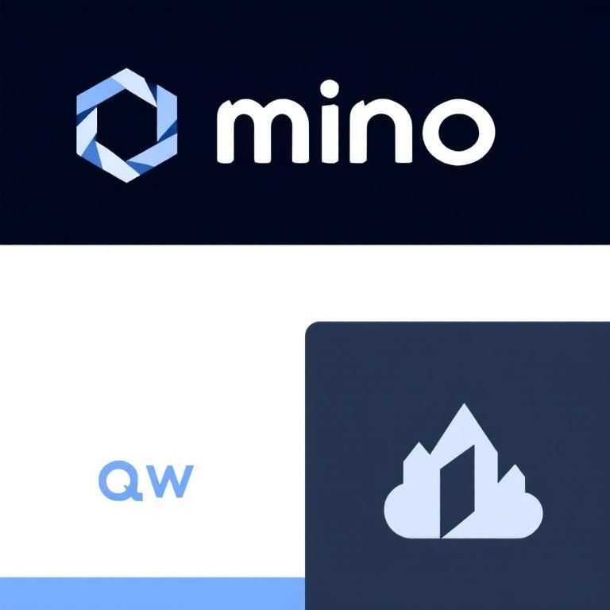
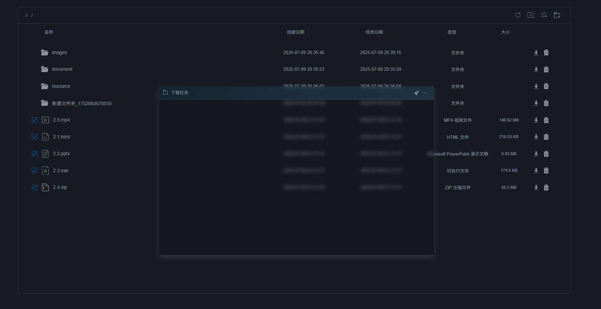
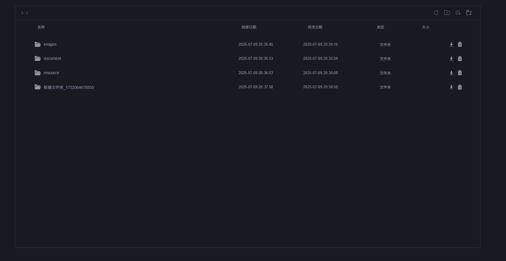
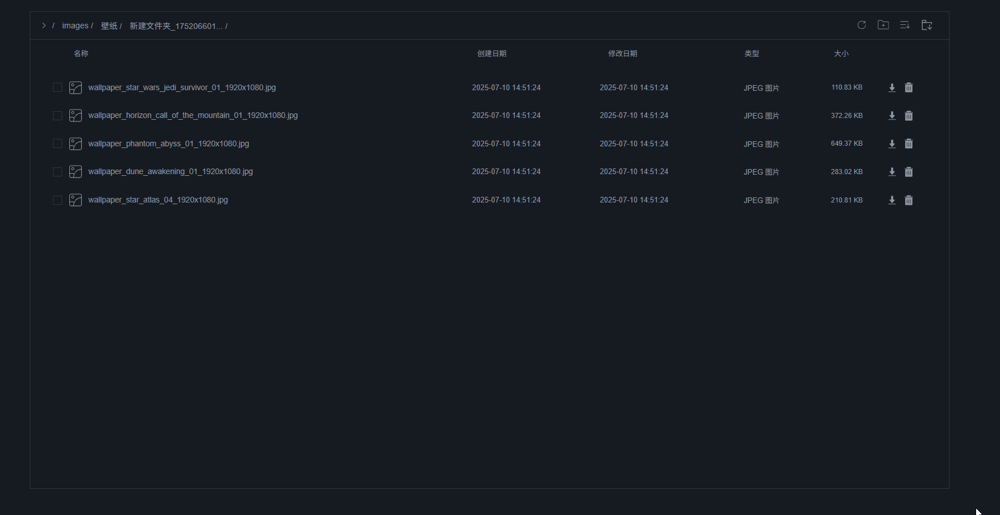
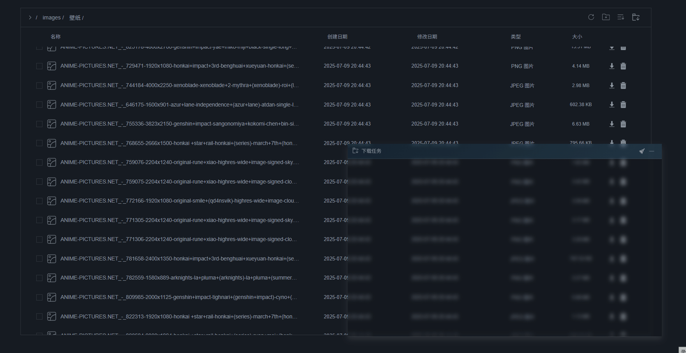

<a id="readme-top"></a>

### [简体中文](https://github.com/g-qw/mcs/blob/main/README.md) | [English](https://github.com/g-qw/mcs/blob/main/README.en.md)

<!-- PROJECT SHIELDS -->
<!--
*** I'm using markdown "reference style" links for readability.
*** Reference links are enclosed in brackets [ ] instead of parentheses ( ).
*** See the bottom of this document for the declaration of the reference variables
*** for contributors-url, forks-url, etc. This is an optional, concise syntax you may use.
*** https://www.markdownguide.org/basic-syntax/#reference-style-links
-->
[![Contributors][contributors-shield]][contributors-url]
[![Forks][forks-shield]][forks-url]
[![Stargazers][stars-shield]][stars-url]
[![Issues][issues-shield]][issues-url]
[![Unlicense License][license-shield]][license-url]
[![LinkedIn][linkedin-shield]][linkedin-url]

<!-- PROJECT LOGO -->
<br />
<div align="center">
  <a href="https://github.com/g-qw/mcs">
    
  </a>

  <h3 align="center">Minio Cloud Storage</h3>

  <p align="center">
    基于MinIO构建的Web云存储系统，旨在提供响应迅速、高性能和高并发的存储和浏览体验。
    <br />
    <a href="https://github.com/g-qw/mcs"><strong>探索文档 »</strong></a>
    <br />
    <br />
    <a href="https://github.com/g-qw/mcs">查看演示</a>
    &middot;
    <a href="https://github.com/g-qw/mcs/issues/new/choose">报告问题</a>
    &middot;
    <a href="https://github.com/g-qw/mcs/issues/new/choose">请求功能</a>
  </p>
</div>

- [关于项目](#关于项目)
  - [支持的功能](#支持的功能)
  - [项目目标](#项目目标)
  - [技术栈](#技术栈)
- [开始使用](#开始使用)
  - [前提条件](#前提条件)
  - [安装步骤](#安装步骤)
- [使用方法](#使用方法)
- [性能测试](#性能测试)
  - [JMeter 压力测试](#jmeter-压力测试)
- [路线图](#路线图)
- [贡献指南](#贡献指南)
  - [主要贡献者](#主要贡献者)
- [许可协议](#许可协议)
- [联系方式](#联系方式)
- [致谢](#致谢)

<!-- ABOUT THE PROJECT -->
## 关于项目

MinIO 是一款开源的高性能分布式对象存储系统，此项目基于 MinIO 构建了一个微服务的云存储系统。整个系统采用 Spring Boot 技术栈构建，运用了流行的微服务架构，涵盖用户服务、邮箱服务、上传服务、下载服务、文件系统服务以及网关服务，用于身份校验和负载均衡。在前端，使用 Vue 3 搭建了一个类似 GitHub 风格的 Web UI，旨在为用户提供类似 Windows 文件资源管理器的便捷体验。整个 UI 设计简洁线性，操作流畅自然，使用起来真的很酷！

### 支持的功能

- 响应式、支持并发的文件上传和下载
- 支持单文件上传、多文件上传、分块上传
- 支持单文件下载、分块下载
- 在上传和下载文件时自动选择合适的方式上传
- 虚拟的文件系统，支持文件的删除，文件夹的创建和修改名称，空文件夹的删除

### 项目目标

浏览器功能强大，但尚未被充分利用来解决文件预览和娱乐需求。如果基于浏览器为云盘文件添加预览功能，云存储服务就能从简单的存储工具升级为全方位的生态系统。用户可在浏览器中预览各类文件，无需切换软件，节省时间和精力，避免兼容性问题。

而且，云存储系统可以通过集成强大程序来强化服务。比如用 FFmpeg 处理图片、视频、音乐、文档等文件，实现转码、裁剪、编辑等功能。同时，集成开源文档编辑器、图片查看器和代码编辑器等应用，让用户在浏览器中完成文件预览、编辑和处理。此外，结合爬虫技术，可以实现自动化的数据收集和整理，帮助用户从互联网上抓取有价值的信息并存储到云盘中，进一步丰富云存储的内容和应用场景，打造一个功能强大且全面的云存储生态系统，满足用户多样化的需求。

实现这些目标确实不容易，技术、资源、时间等方面都有挑战。但是我期待有一天能够实现，希望有兴趣的朋友可以加入我们一起开发！

[![Minio Cloud Storage Screen Shot][product-screenshot]](https://github.com/g-qw/mcs)

<p align="right"><a href="#readme-top">↑</a></p>

### 技术栈

这是目前使用到的技术栈：

- [![Spring Boot][SpringBoot]][SpringBoot-url]
- [![Spring WebFlux][SpringWebFlux]][SpringWebFlux-url]
- [![Spring Gateway][SpringGateway]][SpringGateway-url]
- [![MyBatis][MyBatis]][MyBatis-url]
- [![Redis][Redis]][Redis-url]
- [![Vue 3][Vue3]][Vue3-url]

<!-- URLs -->
[SpringBoot]: https://img.shields.io/badge/SpringBoot-6DB33F?style=for-the-badge&logo=springboot&logoColor=white
[SpringBoot-url]: https://spring.io/projects/spring-boot
[SpringWebFlux]: https://img.shields.io/badge/Spring%20WebFlux-6DB33F?style=for-the-badge&logo=spring&logoColor=white
[SpringWebFlux-url]: https://spring.io/projects/spring-webflux
[SpringGateway]: https://img.shields.io/badge/Spring%20Gateway-6DB33F?style=for-the-badge&logo=spring&logoColor=white
[SpringGateway-url]: https://spring.io/projects/spring-cloud-gateway
[MyBatis]: https://img.shields.io/badge/MyBatis-007991?style=for-the-badge&logo=mybatis&logoColor=white
[MyBatis-url]: https://mybatis.org/
[Redis]: https://img.shields.io/badge/Redis-DC382D?style=for-the-badge&logo=redis&logoColor=white
[Redis-url]: https://redis.io/
[Vue3]: https://img.shields.io/badge/Vue.js-4FC08D?style=for-the-badge&logo=vue.js&logoColor=white
[Vue3-url]: https://vuejs.org/

<p align="right"><a href="#readme-top">↑</a></p>

<!-- GETTING STARTED -->
## 开始使用

以下是一个关于如何在本地设置项目的示例说明。按照这些简单的示例步骤，即可在本地运行副本。

### 前提条件

我将在下面列出构建此项目所需要的基础服务组件和依赖，需要注意本项目是在 Windows 进行的开发工作：

- [nacos-server-2.5.0](https://nacos.io/download/release-history/?spm=5238cd80.6a33be36.0.0.10651e5dOU7bmS)

- [postgresql-15.13-2](https://www.postgresql.org/download/)
  - [postgresql zip archive](https://www.enterprisedb.com/download-postgresql-binaries)

- [Redis 8.0.3 for Windows](https://github.com/redis-windows/redis-windows/releases/tag/8.0.3)

- [MinIO Server & MinIO Client](https://www.minio.org.cn/download.shtml#/windows)

- [Node.js v20.3.1](https://nodejs.org/zh-cn/download)

### 安装步骤

以下是在 Windows 系统中安装部署本项目的详细步骤：

(1) 将项目克隆到本地

```bash
git clone <git@github.com>:g-qw/mcs.git
```

(2) 安装并初始化 postgresql。我使用是zip版本的postgresql Windows版本，在 pgsql 的解压目录执行以下内容完成 pgsql 的初始化(注意替换成你的安装目录)：

```bash
cd path/to/pgsql
mkdir data
initdb -D "./data" -U postgres -A password -W
```

启动 pgsql:

```bash
cd ./bin && pg_ctl -D ../data -l ../logs/logfile.txt start
```

停止 pgsql:

```bash
cd ./bin && pg_ctl -D ../data stop
```

执行项目中 `init/db_init.sql` 初始化数据库

(3) 初始 minio，在你的 minio 的安装目录(包含`mc`、`minio`的路径)执行以下操作

创建你的密码文件 `.pwd`，你可以在启动前编辑此文件来修改管理员密码：

```bash
echo "minio_password" > .pwd
```

每次可以通过此 bat 脚本来启动 `minio`，启动的 `minio` 包含一个用户名为 `minio_admin`，密码为 `.pwd` 内容的超级用户：

```bash
@echo off
set MINIO_ROOT_USER=minio_admin
set /p MINIO_ROOT_PASSWORD=<.pwd
minio.exe server ./data --address 127.0.0.1:9000 --console-address 127.0.0.1:9090
pause
```

(4) 为你的 `Redis` 添加密码，在 `redis.conf` 添加配置：

```bash
requirepass "your_password"
```

双击 `redis` 安装目录的 `start.bat` 启动 `redis`。

(5) 启动你的 Nacos，在本地我们使用单机启动，在 nacos 的 `bin` 目录运行：

```bash
.\startup.cmd -m standalone
```

(6) 确保中间件启动完毕，使用 IDEA 打开本项目，使用 Maven 在父项目 `cloud-storage-cluster` 安装项目需要的所有依赖，并修改各项目的配置，然后你可以启动项目的所有服务。

(7) 启动 Web UI，在项目的 `/webapp/cloud-storage-vue` 执行以下操作：

安装依赖：

```bash
npm install
```

启动 Web UI：

```bash
npm run dev
```

在浏览器访问 `http://localhost:5173/`

<p align="right"><a href="#readme-top">↑</a></p>

<!-- USAGE EXAMPLES -->
## 使用方法

- 上传文件


- 下载文件



- 切换目录



- 批量删除文件



- 下载选中的文件


- 右键选项菜单，对选中的文件批量下载和删除



<p align="right"><a href="#readme-top">↑</a></p>

## 性能测试

### JMeter 压力测试

测试背景：

- JVM 调优：false
- JVM 堆内存：4G
- 线程池的阻塞队列容量：256
- 硬件：Ryzen 7 5800H，16 GB，SAMSUNG MZVL2512HCJQ-00B00

以下是 JMeter 压力测试数据：

| 测试场景       | 单文件大小 | 文件数量 | 总请求数 | 持续时间 (s) | 请求速率 (qps) | 文件速率 (fps) |
| -------------- | ---------- | -------- | -------- | ------------ | -------------- | -------------- |
| 单文件上传     | 100 KB     | 1        | 250 000  | 2 208        | 113            | 113            |
| 单文件上传     | 1 MB       | 1        | 25 000   | 465          | 53.76          | 53.76          |
| 单文件上传     | 5 MB       | 1        | 250      | 24           | 10.4           | 10.4           |
| 单文件上传     | 5 MB       | 1        | 2 500    | 190          | 13.1           | 13.1           |
| 多文件并行上传 | 3 MB       | 10       | 10 000   | 743          | 1.3            | 134.5          |

> 注：fps（files per second）= 总文件数 / 持续时间。  
> 多文件场景下，每个请求携带 10 个文件，因此文件速率远高于请求速率。

<p align="right"><a href="#readme-top">↑</a></p>

<!-- ROADMAP -->
## 路线图

- [ ] 添加文件夹的大小显示
- [ ] 添加文件夹的zip打包下载
- [ ] 添加文件的拖拽移动
- [ ] 添加文件的复制和剪切
- [ ] 添加用户的信息显示
- [ ] 优化下载任务窗口的拖拽功能
- [ ] 支持文本文件的浏览
- [ ] 支持代码文件的高亮浏览

查看[未解决的问题](https://github.com/g-qw/mcs/issues)，以获取完整的提议功能列表（以及已知问题）。

<p align="right"><a href="#readme-top">↑</a></p>

<!-- CONTRIBUTING -->
## 贡献指南

贡献是让开源社区成为学习、启发和创造的绝佳场所的原因。您所做的任何贡献都**非常受人欢迎**。

如果您有能让这个项目变得更好的建议，请分叉（fork）仓库并创建一个拉取请求（pull request）。您也可以直接打开一个标记为“enhancement”的问题。别忘了给项目点个星标（star）！再次感谢！

1. 分叉（Fork）项目
2. 创建您的功能分支（`git checkout -b feature/AmazingFeature`）
3. 提交您的更改（`git commit -m 'Add some AmazingFeature'`）
4. 推送到分支（`git push origin feature/AmazingFeature`）
5. 打开一个拉取请求

### 主要贡献者

暂无

<p align="right"><a href="#readme-top">↑</a></p>

<!-- LICENSE -->
## 许可协议

根据无版权许可（Unlicense）授权。更多详情请查看 LICENSE.txt 文件。

<p align="right"><a href="#readme-top">↑</a></p>

<!-- CONTACT -->
## 联系方式

zzqw - [@Zhihu](https://www.zhihu.com/people/13-47-79-44)

<p align="right"><a href="#readme-top">↑</a></p>

<!-- ACKNOWLEDGMENTS -->
## 致谢

- [Minio的开源支持](https://min.io/)

<p align="right"><a href="#readme-top">↑</a></p>

<!-- MARKDOWN LINKS & IMAGES -->
<!-- https://www.markdownguide.org/basic-syntax/#reference-style-links -->

[contributors-shield]: https://img.shields.io/github/contributors/othneildrew/Best-README-Template.svg?style=for-the-badge
[contributors-url]: https://github.com/othneildrew/Best-README-Template/graphs/contributors
[forks-shield]: https://img.shields.io/github/forks/othneildrew/Best-README-Template.svg?style=for-the-badge
[forks-url]: https://github.com/othneildrew/Best-README-Template/network/members
[stars-shield]: https://img.shields.io/github/stars/othneildrew/Best-README-Template.svg?style=for-the-badge
[stars-url]: https://github.com/othneildrew/Best-README-Template/stargazers
[issues-shield]: https://img.shields.io/github/issues/othneildrew/Best-README-Template.svg?style=for-the-badge
[issues-url]: https://github.com/othneildrew/Best-README-Template/issues
[license-shield]: https://img.shields.io/github/license/othneildrew/Best-README-Template.svg?style=for-the-badge
[license-url]: https://github.com/othneildrew/Best-README-Template/blob/master/LICENSE.txt
[linkedin-shield]: https://img.shields.io/badge/-LinkedIn-black.svg?style=for-the-badge&logo=linkedin&colorB=555
[linkedin-url]: https://linkedin.com/in/othneildrew
[product-screenshot]: images/screenshot.png
